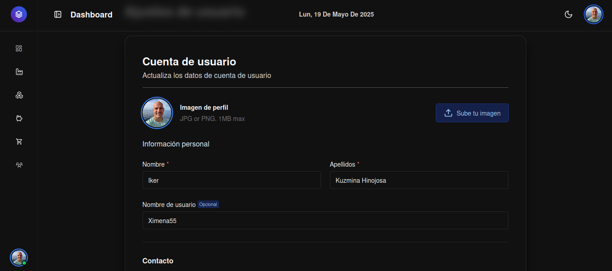
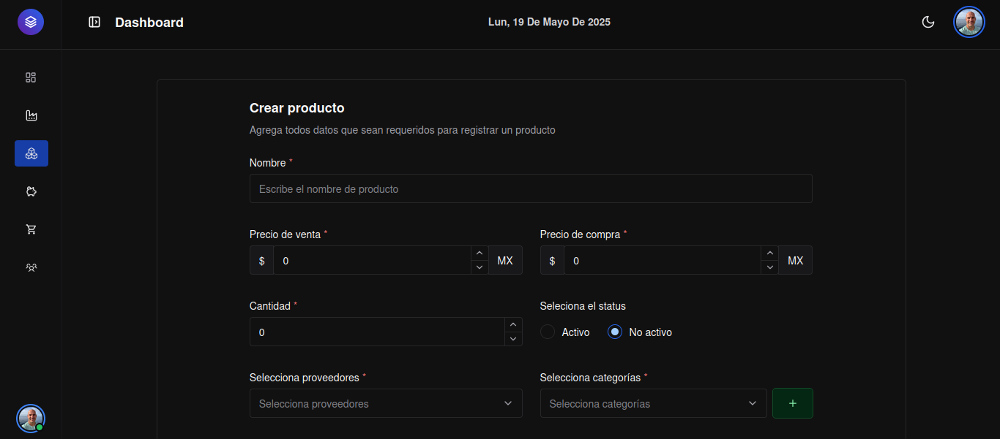

# Admin dashboard for product management inventory

This a fullstack application used to manage product inventory. This includes creating categories, suppliers, users, sales and purchases. It uses Docker to manage individual services such as storing data in MongoDB, communicating with the REST API via Node + Express, and receiving data from React application. During development, challenges were encountered in synchronizing the front-end and back-end applications, as well as the seeding script, which requires fake data in development mode. Some features to consider implementing in the future include optimizing slow-rendering components, specially tables with over 120 rows of data per pagination, and addressing other rendering performance issues. It's also important to avoid unnecessary request from the client to the server.

## Screenshot
|  | 
|--------------------|-------------------
| Profile form | Product form       


## Demo


| [](https://www.youtube.com/watch?v=34rn4rBS6j4) | [](https://www.youtube.com/watch?v=L3pErB93Wxw)
|--------------------|-------------------
| List overview | Login overview      

## ✅ Requirements

Before you begin, ensure your development environment meets the following requirements:

### 🧱 System Dependencies

- **Node.js** v22.15.x
- **npm** (comes with Node.js)
- **Docker** and **Docker Compose** installed and running  
  (required for both backend and frontend services)


## Installation

There are two ways to execute this projects: development mode or production mode.

First, clone the source code repository:

```
git clone https://github.com/BrayanVR31/stockdash-admin-dashboard.git
```

### Development mode

If you're running the projects in the development environment, it's important to define some configuration files like .env.dev that will be used by compose.dev.yaml before it starts.

This file contains the configuration variables (database) that will be used when docker compose starts. Copy and paste this code into your env.dev file in your root project folder.

```
MONGO_INITDB_ROOT_USERNAME: root
MONGO_INITDB_ROOT_PASSWORD: root
MONGO_INITDB_DATABASE: stockdash
```

Navigate to the backend and frontend folders to install all the dependencies necessary to run the application in dev mode:

```
npm install
```

When you clone this project for the first time, the database is empty by default and has no data, but you can run a seed script to populate some faker data.

```
docker compose -f compose.dev.yaml --profile seed up --build seed
```

After defining the configuration files, run the following command to launch all docker containers.

```
docker compose -f compose.dev.yaml up -d
```

If you are interested in using tests, you can use the following Docker command depending on the type of service you want to test (front and back project):

```
docker compose -f compose.dev.yaml --profile test-api up --build test-api
```

Finally, open the local application in your browser, the default address is http://localhost:5173/dashboard
